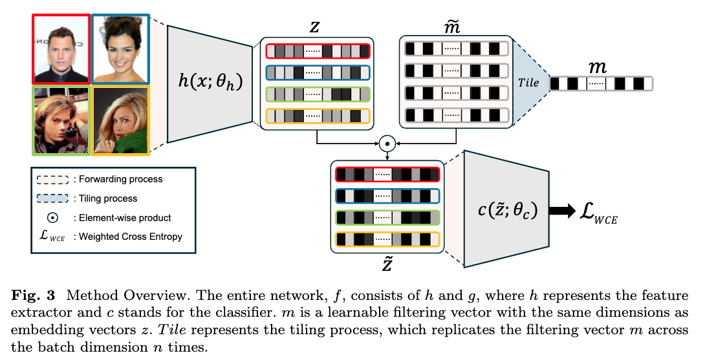

# FairFiltering

### Method
 
- Method Overview. The entire network, $f$, consists of $h$ and $g$, where $h$ represents the feature extractor and $c$ stands for the classifier. $m$ is a learnable filtering vector with the same dimensions as embedding vectors $z$. $Tile$ represents the tiling process, which replicates the filtering vector $m$ across the batch dimension $n$ times.

### Datasets
This repository uses the following datasets for training and evaluation:

1. Waterbirds Dataset
- **Description:** A dataset used for studying distributional robustness, consisting of images of birds labeled as landbirds or waterbirds with spurious correlations.
- **Source:** [Official Waterbirds Dataset](https://github.com/kohpangwei/group_DRO)

2. CelebA Dataset
- **Description:**: A large-scale face attributes dataset containing 200,000+ celebrity images with 40 attribute annotations.
- **Source:** [Official CelebA Dataset](https://mmlab.ie.cuhk.edu.hk/projects/CelebA.html)

3. CivilComments
- **Description:** A dataset of online comments annotated for toxicity, designed for studying bias and fairness in NLP models.
- **Source:** [CivilComments Kaggle Download](https://www.kaggle.com/c/jigsaw-unintended-bias-in-toxicity-classification)
- **Paper:**
  
4. MultiNLI
- **Description:** A large-scale dataset for natural language inference (NLI), covering multiple genres of text.
- **Source:** [Official MultiNLI Dataset](https://cims.nyu.edu/~sbowman/multinli/)
